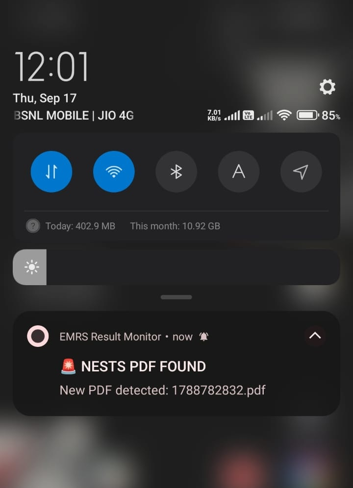
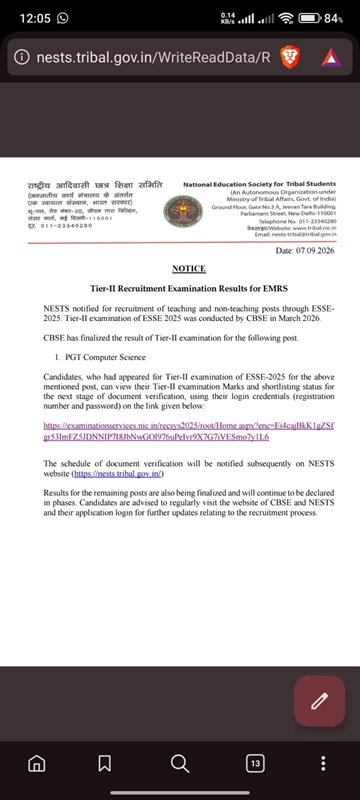
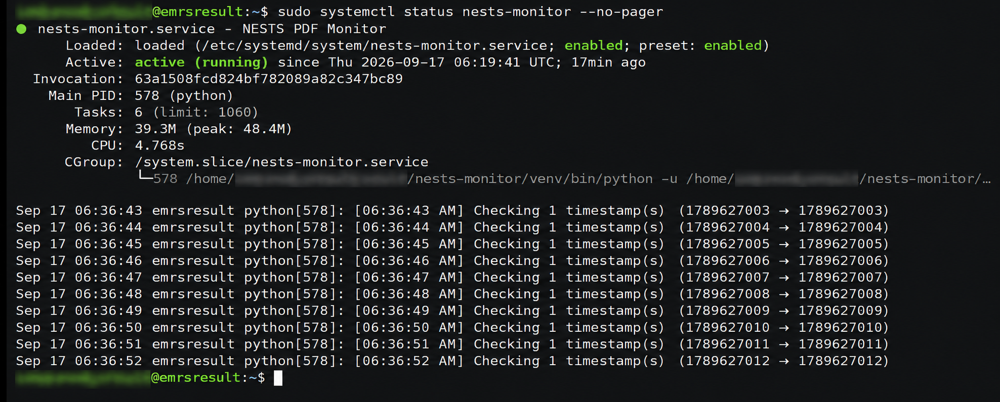

# EMRS Result Monitor

An automated Android notification system built to detect newly available EMRS result documents and notify users instantly.

## Why I built this

A friend was waiting for an EMRS recruitment result and was repeatedly checking for updates. He asked if there was a way to automate the process.

So I built one.

What started as a small automation idea turned into an end-to-end system involving a Python monitoring service, Google Cloud, Firebase Cloud Messaging, and an Android application.

## How it works

```text
NESTS Public Document Repository
              │
              ▼
     Python Monitoring Service
              │
              ▼
       Google Cloud VM
              │
       New PDF detected
              │
              ▼
    Firebase Cloud Messaging
              │
              ▼
        Android App
              │
              ▼
       Instant Notification
              │
              ▼
          Open PDF
```
## Screenshots

### Android App


### Instant Notification



### Result PDF



### Cloud Monitor



## Key features

* Automated monitoring of publicly accessible result documents
* Timestamp-based PDF detection
* Automatic PDF retrieval and archival
* Firebase Cloud Messaging (FCM) notifications
* Topic-based messaging for multiple users
* Android application built with Kotlin and Jetpack Compose
* Background monitoring through a Linux `systemd` service
* Direct PDF opening from notifications
* Automatic notification subscription when the app is installed

## Technical highlights

The repository contains both the Android client and the Python monitoring component, making the complete detection-to-notification workflow reproducible at the architecture level without exposing production credentials or infrastructure details.

One of the more interesting parts of the project was identifying a timestamp-based naming pattern in the public document repository.

The numeric PDF filename corresponds to a Unix timestamp in seconds. This makes it possible to construct and check potential document URLs directly instead of depending exclusively on the visible website interface.

The monitoring service maintains a record of previously detected documents to avoid duplicate notifications.

## Technology stack

### Backend / Monitoring

* Python
* HTTP/REST requests
* Google Cloud Compute Engine
* Linux
* systemd

### Notifications

* Firebase Cloud Messaging
* FCM Topics

### Android

* Kotlin
* Jetpack Compose
* AndroidX
* Firebase Messaging

## Notification flow

When a new document is detected:

```text
New PDF
   ↓
Monitor validates the response
   ↓
PDF is archived
   ↓
FCM topic notification is sent
   ↓
Subscribed Android devices receive the alert
   ↓
User taps notification
   ↓
PDF opens
```

## Project structure

```text
emrs-result-monitor/
├── app/
│   ├── src/
│   │   └── main/
│   │       ├── java/
│   │       ├── res/
│   │       └── AndroidManifest.xml
│   ├── build.gradle.kts
│   └── google-services.json
│
├── monitor/
│   ├── monitor.py
│   ├── requirements.txt
│   └── README.md
│
├── screenshots/
│   ├── app-icon.png
│   ├── notification.jpeg
│   ├── pdf-opened.jpeg
│   └── monitor-running.png
│
├── gradle/
├── build.gradle.kts
├── gradle.properties
├── gradlew
├── gradlew.bat
├── settings.gradle.kts
├── .gitignore
└── README.md
```

The `app/` directory contains the Android client, while `monitor/` contains the Python-based document monitoring service. The `screenshots/` directory contains selected visuals demonstrating the working system.


## Security

No server-side credentials, private keys, signing keystores, FCM registration tokens, or other sensitive infrastructure credentials are included in this repository.

The Android application uses Firebase client configuration, while server-side messaging is handled separately by the monitoring environment.

## Disclaimer

This project interacts only with publicly accessible resources. It does not bypass authentication, access controls, or restricted resources.

## Author

**Rahul Berwal**

Built as a practical automation project combining cloud infrastructure, backend monitoring, mobile development, and real-time notifications.
